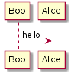

# Editing diagrams using PlantUML

Some figures in this document such as sequence diagram is written as a PlantUML source text file  (*.puml file) and converted to image file (*.png) using PlantUML. Both source and image files should be stored in "images" folder so that editors and contributers can easily modify and regenerate images as well as manage differences between versions using GitHub functionality.

To use plantuml, see following guidance and visit its official site: <http://en.plantuml.com/>

## Example

(plantuml.puml)

```
@startuml
Bob->Alice : hello
@enduml
```

(plantuml.png)



## Usage

### Online tool

You can quickly start from online tool. See: http://www.plantuml.com/plantuml/uml/SyfFKj2rKt3CoKnELR1Io4ZDoSa70000

### Local install

You can install PlantUML locally on your PC, as instructed at: http://en.plantuml.com/starting

Please note that Java is required to run, and optionally Graphviz is required to convert several types of diagrams.

### Atom integration

If you use Atom as text editor, you can install live plantuml previewer from: https://atom.io/packages/plantuml-viewer

You can right-click on the image and choose "Save AS.." to get png image.

Other integrations are also available. See: http://en.plantuml.com/running

### Reference Guide:

You can find reference guide in several languages at: <http://en.plantuml.com/download>
